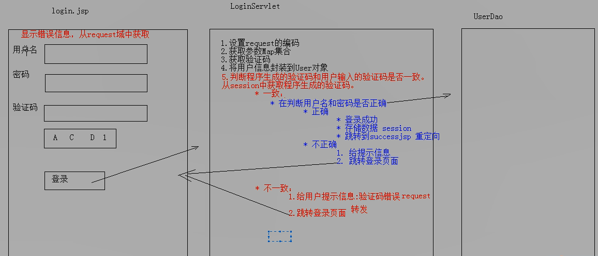

```java
## 今日内容
1. 会话技术 Cookie&Session
    1. Cookie
    2. Session

2.JSP 入门学习

### 会话技术
1. 会话：一次会话中包含多次请求和响应

    * 浏览器第一次给服务器发送请求，会话建立，直到一方断开为止
2. 研究会话的本质是研究 *共享数据* 而共享数据发生在一次会话内的多次请求间
3.Java中共享数据有两种方式
    1.客户端会话技术：Cookie
    2.服务端会话技术：Session

```

```java
Cookie
1.概念：客户端会话技术，将数据保存到客户端
2.快速入门：
    *使用步骤：
    	1.创建Cookie对象，绑定数据
    		*new Cookie(String name,String value)
    	2.发送Cookie对象
    		*response.addCookie(Cookie cookie)
    	3.获取Cookie,拿到数据
    		*Cookie[] request.getCookie()
3.实现原理
    *基于响应头set-cookie和请求头cookie实现
4.cookie细节
    1.一次可不可以发送多个cookie?
    	*可以创建多个Cookie对象，使用response调用多次addCookie方法发送cookie
    2.cookie再浏览器中保存多长时间？
    	1.默认情况下，当浏览器关闭后，Cookie数据被销毁
    	2.持久化存储
    		*setMaxAge(int seconds)
    			1.正数：将Cookie数据写到硬盘文件中。持久化存储。cookie存活时间。
    			2.负数：默认值
    			3.零：删除Cookie信息
    3.cookie能不能存中文？
    	*在tomcat 8 之前cookie中不能直接存储中文数据。
    		*需要将中文数据转码---一般采用URL编码（%E3）
    	* 在tomcat 8之后，cookie支持中文数据。*但是对于特殊字符还是不支持，建议使用URL编码存储，URL解码解析*
    4.cookie获取范围多大？
    	*假设在一个tomcat服务器中，部署了多个web项目，那么在这些web项目中cookie能不能共享？
    		*默认情况下cookie不能共享
    		*setPath(String path):设置cookie的获取范围。默认情况下，设置当前的虚拟目录
    			*如果要共享，则可以将path设置为“/”
    	*假设在不同的tomcat服务器之间cookie的共享问题？
    		*setDomain(String path):如果设置一级域名相同，那么多个服务器之间cookie 可以共享
    			*setDomain(".baidu.com"),那么，tieba.baidu.com 和news.baidu.com中的cookie就可以共享

```

```java
5.Cookie的特点和作用
    1.cookie存储数据在客户端浏览器
    2.浏览器对于单个cookie的大小有限制（4kB)，而且 对同一个域名下的总cookie 数量也有限制(20个)
    *作用：
    	1.cookie一般用于存储少量的不太敏感的数据
    	2.在不登陆的情况下，完成服务器对客户端的身份识别
```

```java
6.案例：上次登录时间
    1.需求：
    	1.访问一个Servlet,如果是第一次访问，则提示：您好，欢迎您首次访问。
    	2.如果不是第一次访问，则提示：欢迎回来，您上次访问时间为：显示时间字符串
    2.分析：
    	1.采用Cookie来完成
    	2.在服务器中的Servelt判断是否存在一个名为lastTime的cookie
    		1.有:不是第一次访问
                	1.响应数据：欢迎回来，您上次访问的时间为：上次访问的时间
                	2.写回cookie：lastTime=系统时间
             2.没有：是第一次访问
                	1.响应数据：您好，欢迎您首次访问
                	2.写回cookie：lastTime=系统时间
                
```

```java
## Session:
	1.概念：服务器端会话技术，在一次绘画的多次请求间共享数据，将数据保存在服务端的对象中。HttpSession
	2.快速入门：
		1.获取HttpSession对象：
			HttpSession session = request.getSession();
		2.使用HttpSession 对象
        	Object getAttribute(String name)
        	void setAttribute(String name, Object value)
        	void removeAttribute(String name)
            
         3.原理
            * Session的实现是依赖于Cookie的。
            
         4.细节：
            1.当客户端关闭后，服务器不关闭，两次获取的Session是否为同一个？
            	*默认情况下:不是。
			   *如果需要相同，则可以通过创建Cookie，键为JSESSIONID，设置最大存活时间，让cookie持久化保存。
                    Cookie c = new Cookie("JSESSION",session.getID());
					c.setMaxAge(60*60);
					response.addCookie(c);
            2.客户端不关闭，服务器关闭，两次获取的session 是同一个吗？
                *不是同一个，但是要确保数据不丢失
                	* session的钝化：
                		*再服务器正常关闭之前，将session对象系列化到硬盘上
                	*session的活化：
                		*在服务器启动后，将session文件转化为内存中的session 对象即可。
            3.session的失效时间？
                1.服务器关闭
                2.session对象调用invalidate()。
                3.session默认失效时间 30分钟
                	选择性配置修改
                	<session-config>
                		<session-timeout>30</session-timeout>
                	</session-config>
                
             4.session的特点
                	1.session用于存储一次会话的多次请求的数据、存在服务器端
                	2.session可以存储任意类型、任意大小的数据
                	*session与cookie的区别
                		1.session存储数据在服务器端，Cookie在客户端
                		2.session没有数据大小限制，Cookie有
                		3.session数据安全，Cookie相对于不安全
```

```java
## 案例：验证码
    案例需求：
	1. 访问带有验证码的登录页面login.jsp
	2. 用户输入用户名，密码以及验证码。
		* 如果用户名和密码输入有误，跳转登录页面，提示:用户名或密码错误
		* 如果验证码输入有误，跳转登录页面，提示：验证码错误
		* 如果全部输入正确，则跳转到主页success.jsp，显示：用户名,欢迎您
```

